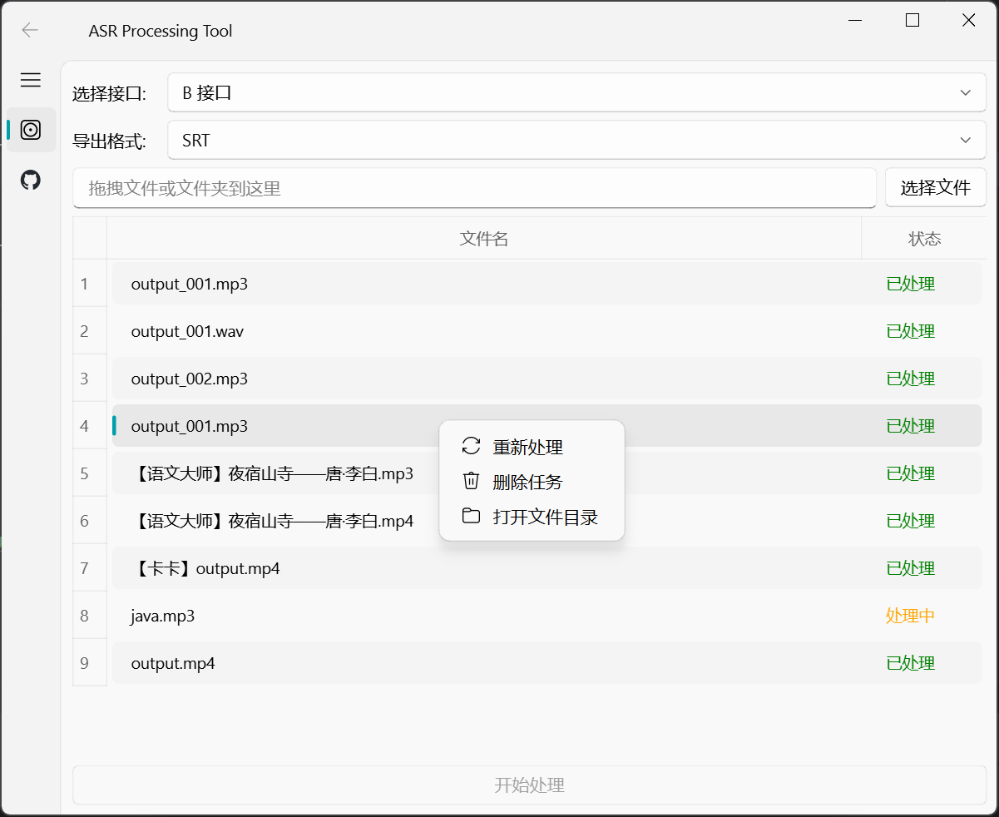

# 🎤 AsrTools

## 🌟 **特色功能**

- 🚀 **无需复杂配置**：无需 GPU 和繁琐的本地配置，小白也能轻松使用。
- 🖥️ **高颜值界面**：基于 **PyQt5** 和 **qfluentwidgets**，界面美观且用户友好。
- ⚡ **效率超人**：多线程并发 + 批量处理，文字转换快如闪电。
- 📄 **多格式支持**：支持生成 `.srt` 和 `.txt` 、`ass`字幕文件，满足不同需求。

欢迎为项目给上一个 Star ⭐ 。

**主界面截图示例：**




### 🖥️ **快速上手**

1. **启动应用**：运行下载的可执行文件或通过命令行启动 GUI 界面。
2. **选择 ASR 引擎**：在下拉菜单中选择你需要使用的 ASR 引擎。
3. **添加文件**：点击“选择文件”按钮或将文件/文件夹拖拽到指定区域。
4. **开始处理**：点击“开始处理”按钮，程序将自动开始转换，并在完成后在原音频目录生成 `.srt` 或 `.txt` 字幕文件。（默认保持 3 个线程运行）

## 🛠️ **安装指南**

###  **从源码安装（开发者）**
从源码运行，请按照以下步骤操作：

1. **克隆仓库并进入项目目录**

    ```bash
    git clone https://github.com/bozoyan/AsrTools.git
    cd AsrTools
    conda create -n asrtools python=3.12 -y #可以单独建环境
    conda activate asrtools
    ```

    - conda配置文件 查找下有没这个配置文件
    ```bash
    cat > ~/.condarc << EOF
channels:
  - defaults
show_channel_urls: true
default_channels:
  - https://mirrors.tuna.tsinghua.edu.cn/anaconda/pkgs/main
  - https://mirrors.tuna.tsinghua.edu.cn/anaconda/pkgs/free
  - https://mirrors.tuna.tsinghua.edu.cn/anaconda/pkgs/r
  - https://mirrors.tuna.tsinghua.edu.cn/anaconda/pkgs/msys2
custom_channels:
  conda-forge: https://mirrors.tuna.tsinghua.edu.cn/anaconda/cloud/conda-forge
EOF
```


- 直接安装 pyqt（自动下载，1-2 分钟）
conda install -y pyqt


2. **安装依赖并运行**

    - **启动 GUI 界面**

        ```bash
        pip install -r requirements.txt

        python asr_gui.py
        ```
---
## 优化字幕 项目简介

本项目旨在处理和优化字幕文件（SRT格式），通过自动语音识别（ASR）数据的分段合并与拆分，提高字幕的可读性和同步精度。主要功能包括：

- **ASR数据预处理**：标准化 **中英文文本**，去除纯标点符号，处理中英文混合文本等。
- **长分段的智能拆分**：利用大语言模型（LLM）对超过最大词数的中英文分段进行拆分，确保每个分段的可读性。
- **缓存机制**：通过哈希生成缓存键，减少测试过程的重复请求，提高处理效率。


### 使用方法

1. **准备SRT文件**

   确保你有需要处理的SRT文件，例如：`test_data/演讲.srt`

2. **运行主程序**

   该脚本将读取指定的SRT文件，进行预处理、分段合并与拆分，并生成一个合并后的SRT文件，如`test_data/演讲_merged.srt`

### 示例用法

```python
python main.py --srt_path test_data/演讲.srt --save_path test_data/演讲_merged.srt
```

假设你有一个名为`演讲.srt`的字幕文件，内容如下：

```srt
1
00:00:09,100 --> 00:00:09,260
大

2
00:00:09,260 --> 00:00:09,420
家

3
00:00:09,420 --> 00:00:09,620
好

4
00:00:09,820 --> 00:00:09,940
我

5
00:00:09,940 --> 00:00:10,180
叫

6
00:00:10,220 --> 00:00:10,420
杨

7
00:00:10,420 --> 00:00:10,580
玉

8
00:00:10,580 --> 00:00:10,740
溪

...

```

运行`main.py`后，将生成一个合并后的文件`李白_merged.srt`，内容示例如下：

```srt
1
00:00:09,100 --> 00:00:09,620
大家好

2
00:00:09,820 --> 00:00:10,740
我叫杨玉溪

3
00:00:11,220 --> 00:00:14,220
来自有着良好音乐氛围的福建厦门

4
00:00:14,700 --> 00:00:15,420
自记事起

```

### 结果说明

- **合并分段**：原始SRT文件中每个单一字符或单词作为一个分段，经过处理后，分段被合并为一句完整的句子，提升了字幕的可读性。

- **时间同步**：合并后的字幕段落时间跨度根据原始分段的起止时间自动调整，确保字幕与视频内容同步。

- **智能拆分**：对于合并后仍然超过最大词数的字幕段落，系统将自动利用LLM进行语义拆分，避免在不适当的位置断句，保持字幕的连贯性和自然性。

### 项目结构

- **main.py**：主程序，负责读取SRT文件，进行预处理、分段合并与拆分，并保存结果。
- **split_by_llm.py**：使用LLM进行文本断句的模块，包含缓存机制以提升效率。
- **ASRData.py**：处理ASR数据的模块，定义数据结构和相关操作。
- **test_data/**：存放测试用的SRT文件及处理后的结果文件。
- **cache/**：存放LLM断句结果的缓存文件。
- **requirements.txt**：项目依赖列表。
- **README.md**：项目说明文件。


## 更新日志

- **（v1.0.0）初始发布，实现基本的SRT文件处理功能。
-  **（v1.1.0）已经增加视频文件支持🎥**：支持直接导入视频文件，自动转换为音频进行处理，无需手动转换。

## 📬 **联系与支持**

- **Issues**：[提交问题](https://github.com/bozoyan/AsrTools/issues)

感谢您使用 **AsrTools**！🎉  

目前项目的相关调用和GUI页面的功能仍在不断完善中...

希望这款工具能为您带来便利。😊

---
## Star History

[](https://star-history.com/#bozoyan/AsrTools&Date)
